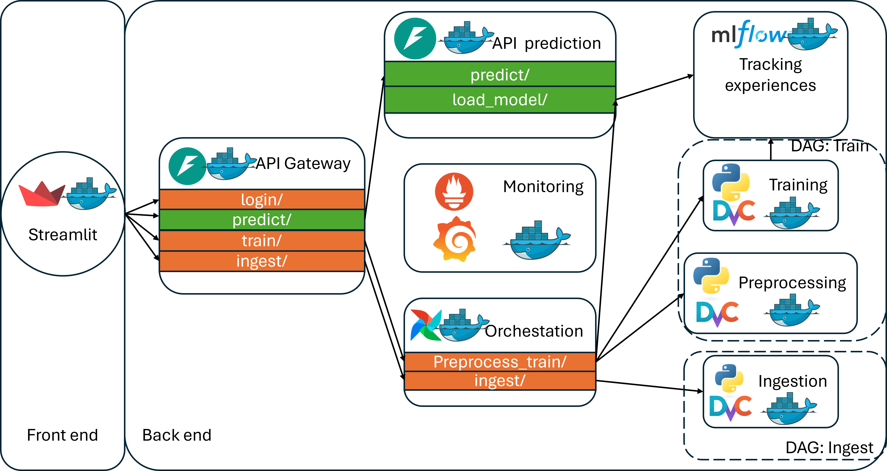

# Projet MLOps - API de prédiction du Méteo en Australie - #AUG24BMLE
Ce projet implémente un système de prédiction du lendemain en Australie basé sur des données météorologiques. Le projet déploie une structure complète MLOps qui permet d’automatiser toute le cycle de vie d’un projet de Machine Learning. L’application est capable d’exécuter toutes les tâches propres d’une pipeline d’un modèle, en commençant par l’ingestion de données, le proprocessing, le réentrainement du modèle et la mise à jour de l’Endpoint de l’API exposant le modèle.

## 1. Structure du projet
<details>
    <summary>root/</summary>
    &emsp;.gitignore<br>
    &emsp;docker-compose.yaml<br>
    &emsp;dvc.lock<br>
    &emsp;.dvcignore<br>
    &emsp;dvc.yaml<br>
    &emsp;LICENSE<br>
    <details>
    <summary>.dvc/</summary>
        &emsp;.gitignore<br>
        &emsp; config<br>
    </details>
    <details>
    <summary>config/</summary>
        &emsp; config.yaml
    </details>
    <details>
    <summary>data/</summary>
        <details>
        <summary>&emsp;monitoring/</summary>
            &emsp;&emsp;&emsp;visualizations/<br>
        </details>
        &emsp;&emsp; processed/<br>  
        &emsp;&emsp; production_logs/<br>  
        &emsp;&emsp; raw/<br>  
    </details>
    <details>
    <summary>logs/</summary> 
    &emsp;&emsp;airflow/
    </details>
    <details>
    <summary>metrics/</summary>
    </details>
    <details>
    <summary>mlflow/</summary>
        &emsp;&emsp;mlartifacts/
        <details>
        <summary>&emsp;mlruns/</summary>
            &emsp;&emsp;&emsp;0/
            <details>
            <summary>&emsp;&emsp;models/</summary>
                &emsp;&emsp;&emsp;&emsp;model/
            </details>
        </details>
    </details>
    <details>
    <summary>src</summary>
        <details>
        <summary>&emsp;airflow/</summary>
            <details>
            <summary>&emsp;&emsp;dags/</summary>
                &emsp;&emsp;&emsp;&emsp; ingestion_dag.py  <br>
                &emsp;&emsp;&emsp;&emsp; monitoring_dag.py  <br>
                &emsp;&emsp;&emsp;&emsp; tools.py  <br>
                &emsp;&emsp;&emsp;&emsp; train_dag.py  <br>
                <details>
                <summary>&emsp;&emsp;&emsp; monitoring/</summary>
                    &emsp;&emsp;&emsp;&emsp;&emsp;drift_monitoring.py
                </details>
            </details>
            &emsp;&emsp;&emsp;plugins/
        </details> 
        <details>
        <summary>&emsp;api_model/</summary>
            &emsp;&emsp;&emsp;.dockerignore<br>
            &emsp;&emsp;&emsp;app_model.py<br>
            &emsp;&emsp;&emsp;Dockerfile<br>
            &emsp;&emsp;&emsp;input_classes.py<br>
            &emsp;&emsp;&emsp;requirements.txt<br>
        </details> 
        <details>
        <summary>&emsp;Gateway/</summary>
            &emsp;&emsp;&emsp;api_securite.py<br> 
            &emsp;&emsp;&emsp;Dockerfile<br>
            &emsp;&emsp;&emsp;requirements.txt<br>
        </details>
        <details>
        <summary>&emsp;ingest</summary> 
            &emsp;&emsp;&emsp;.dockerignore<br>
            &emsp;&emsp;&emsp; Dockerfile<br>
            &emsp;&emsp;&emsp; ingest_data.py<br>
            &emsp;&emsp;&emsp; requirements.txt<br>
            &emsp;&emsp;&emsp; script_meteo.py<br>
            &emsp;&emsp;&emsp; url_dict.py<br>
        </details> 
        <details>
        <summary>&emsp;mlflow/</summary>
            &emsp;&emsp;&emsp;Dockerfile<br>
            &emsp;&emsp;&emsp; requirements.txt<br>
        </details>
        <details>
        <summary>&emsp;monitoring/</summary>
            &emsp;&emsp;&emsp; Dockerfile<br>
            &emsp;&emsp;&emsp; drift_detection.py<br>
            &emsp;&emsp;&emsp; model_comparison.py<br>
            &emsp;&emsp;&emsp; requirements.txt<br>
        </details>
        <details>
        <summary>&emsp;preprocessing/</summary>
            &emsp;&emsp;&emsp; preprocess.py<br>
            &emsp;&emsp;&emsp; Dockerfile<br>
            &emsp;&emsp;&emsp; requirements.txt<br>
        </details>
        <details>
        <summary>&emsp;streamlit_app </summary>
            &emsp;&emsp;&emsp; app.py  <br>
            &emsp;&emsp;&emsp; Dockerfile  <br>
            &emsp;&emsp;&emsp; requirements.txt<br>
        </details>
        <details>
        <summary>&emsp;train</summary>
            &emsp;&emsp;&emsp; .dockerignore  <br>
            &emsp;&emsp;&emsp; Dockerfile  <br>
            &emsp;&emsp;&emsp; requirements.txt  <br>
            &emsp;&emsp;&emsp; train.py<br>
        </details>
    </details>
    <details>
    <summary>tests_unitaires  </summary>
    &emsp;&emsp; recap.md  <br>
    &emsp;&emsp; test_preprocess.py  <br>
    &emsp;&emsp; test_xgboost_model.py <br>
    </details>
</details>

## 2. Explication du projet
### Structure global


Il y a différents microservices qui tournent au même temps pour faire fonctionner l'application:
- #### Ingestion
Ce microservices sert à récupérer les données journalières des différents endroits pour les enregistrer sur la base de données brute pour une prochaine entrainement. Dedans le conteneur, la gestion de version des données brutes est gérée via DVC.
- #### Preprocessing
Ce microservice récupère la dernière version des données brutes et preprocess les données pour les tourner directement vers de données exploitables dans l’entrainement.
Dedans le conteneur, la gestion de version des données prétraités est géré via DVC.
- #### Training 
Une fois entrainés la gestion du stockage des expériences et modèles du serveur MLFlow est géré via DVC.
- #### MLFlow
Ce microservice crée un serveur pour stocker et tracker les différentes expériences et versions de modèles.
- #### API_prediction
Ce microservice charge en mémoire la dernière version du modelé et le mets à disposition à partir de l’Endpoint ‘predict’.
- #### Orchestation
Ce microservice s’en charge de l’ingestion et entrainement périodique à travers des microservices concernés.
- #### Monitoring
Ce microservice suit le comportement général du système. L’utilisation de chaque microservice et ses performances
- #### API_Gateway
Ce microservice fait du pont entre l’utilisateur et backend de l’application. Il s’en charge de contrôler les droits des différents utilisateurs.
- #### Streamlit
Ce microservice fait construit l’interface graphique pour communiquer avec le modèle et tous les microservices.

## 3. Déploiement
Pour faire tourner l'application vous devez suivre les commandes suivants

```
git clone bmle-aug24/Meteo_group   # Copier le repo à partir de GitHub
dvc pull                           # Télécharge la dernière version des données. 
```
Créez vos données d'enviromnement avant de lancer l'application
```
echo -e "AIRFLOW_UID=$(id -u)\nAIRFLOW_GID=0" > .env              # Sur linux
Set-Content -Path .env -Value "AIRFLOW_UID=50000`nAIRFLOW_GID=0"  # Sur Windows
docker-compose up -d               # Déclenche tous les serveurs
```

Vérifiez que tous les conteneurs sont bien lancés. Utilisez le command:
```
docker ps                          # Vérification des conteneurs
```
Une fois l'application lancé, ouvrez votre explorateur et connectez vous à:

[http:localhost:8002](http:localhost:8002)

## 4. Utilisation de l'application
### 4.1 Utilisation 'user'
Une fois dans l'interface graphique, insérez les crédentiels 'user' suivants:
- Nom d'utilisateur : 'user'
- Mot de passe : 'user'


Une fois authentifié vous pouvez remplir l’information requis pour lancer la prédiction.


### 4.2 Utilisation 'admin'
Si vous voulez accéder en tant qu'Administrateur, insérez les crédentiels suivantes:
- Nom d'utilisateur: 'admin'
- Mot de passe: 'admin'

Le rôle administrateur vous ouvre accès à nouvelles fonctionnalités propres à l'administrateur


Voici une description des différentes fonctionnalités

- #### Lancer ingestion
Permet de lancer l'ingestion des données indépendamment si la collection de données journalières a été réalisé ou pas.

- #### Lancer l'entraînement
Permet de lancer l'entraînement du modèle indépendamment si ce tâche hebdomadier a été réalisé ou pas.

- #### Airfow
Lien vers l'interface Airflow qui tourne au port `8080` ( [http:localhost:8080](http:localhost:8080) )


- #### MLFlow
Lien vers l'interface MLFlow qui tourne au port `8100` ( [http:localhost:8100](http:localhost:8100) )


### 4.3 Grafana & Prometheus (Monitoring)
Pour superviser et visualiser les métriques du système, nous utilisons Grafana et Prometheus.

- #### Accéder à Grafana

- Ouvrez http://localhost:3000 dans votre navigateur
- Connectez-vous avec les identifiants par défaut (par exemple, admin / admin)

- #### Ajouter Prometheus comme source de données

- Dans Grafana, cliquez sur Configuration → Data Sources → Add data source → Prometheus
- Indiquez l’URL : http://prometheus:9000 (si vous utilisez le réseau interne Docker)
- Testez la connexion puis enregistrez.

- #### Importer un dashboard

- Dans Grafana, cliquez sur + → Import
- Saisissez l’ID d’un dashboard existant (par exemple 3662)
- Sélectionnez la source de données Prometheus précédemment créée
- Cliquez sur Import pour finaliser.

Une fois le dashboard importé, vous pourrez visualiser diverses métriques (taux de requêtes, consommation de ressources, dérive du modèle, etc.) pour suivre en temps réel l’état de votre application.

## 5. Auteurs
Ce projet a été développés dans le cadre de la formation Machine Learning Engineer, format bootcamp de DataScientest. Les membres et contributeurs du répertoire sont: 

### Contributeurs
- Leila BELMIR /
  [LinkedIn]() /
  [GitHub]()

- Anas MBARKI /
  [LinkedIn](https://www.linkedin.com/in/anas-mbarki-1010/) /
  [GitHub](https://github.com/AnasMba19)

- Ellie PASCAUD /
  [LinkedIn]() /
  [GitHub]()

- Sergio VELASCO /
  [LinkedIn](https://www.linkedin.com/in/sergio-velasco/) /
  [GitHub](https://github.com/smvelascoc)

### Mentor
- Sébastien SIME /
  [LinkedIn](https://www.linkedin.com/in/s-sime/) /
  [GitHub](https://github.com/ssime-git)